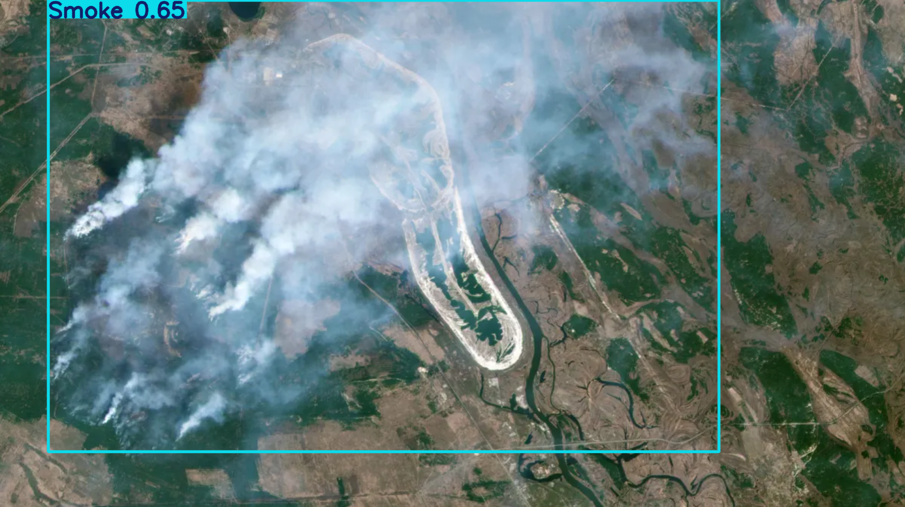
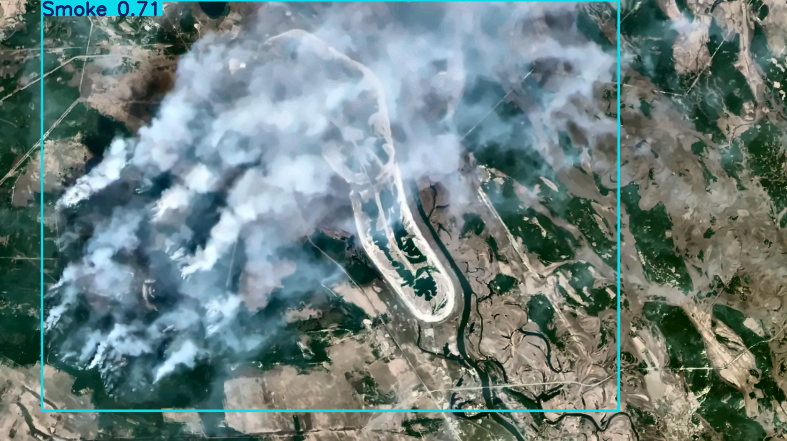

# YOLO-DSP-enhanced-detection
Improving YOLO confidence using classical DSP enhancement (Denoising → CLAHE → Sharpening).


## 1. Overview

This project explores whether *classical Digital Signal Processing (DSP)* techniques can
improve the performance of modern deep-learning–based object detectors such as YOLO.
Satellite and aerial imagery often suffers from:

- haze, smoke, and atmospheric scattering  
- low contrast and poor illumination  
- noise due to sensors and compression  
- low visibility conditions in wildfire scenarios  

These degradations reduce YOLO’s confidence scores and can cause missed detections.

To address this, we propose a **DSP-augmented object detection pipeline** that enhances the
image *before* feeding it into YOLO:

1. **Denoising** using Non-Local Means  
2. **Local contrast enhancement** using CLAHE (L-channel in LAB)  
3. **Detail sharpening** using unsharp masking  

This simple, lightweight pre-processing improved YOLO’s detection confidence on wildfire
datasets by **~9% on average**, with clearer smoke boundaries and more stable bounding boxes.

The approach is model-agnostic and can be applied to any YOLO variant or object detection
backbone.

---

## 2. Repository Structure
``` bash
.
├── src/
│   ├── preprocess.py
│   ├── detector.py
│   └── compare.py
├── examples/
├── results/
├── models/
├── notebooks/
├── README.md
├── requirements.txt
└── main.py
```

---

## 3. Pipeline
The end to end pipeline is as follows:

#### **Ⅰ. Raw Image**
The input is a satellite or aerial RGB image that may contain:
- smoke plumes  
- reduced contrast  
- sensor noise  
- blurred or low-detail regions  

These degradations often lead to weak confidence scores or missed detections.

#### **Ⅱ. DSP Enhancement Stage**
Before sending the image to YOLO, we apply a sequence of classical DSP operations:

- **Non-Local Means Denoising:**  
  Removes high-frequency noise while preserving edges.

- **CLAHE (Contrast Limited Adaptive Histogram Equalization):**  
  Enhances local contrast in the L-channel of the LAB color space, improving visibility
  in hazy areas.

- **Sharpening (Unsharp Masking):**  
  Restores lost detail and reinforces boundaries of smoke plumes.

This stage produces a clearer version of the image that makes it easier for YOLO to interpret.

#### **Ⅲ. YOLO Detection**
The enhanced image is passed to a YOLO model (YOLOv8/YOLOv10) using the same inference
parameters as the raw version. No retraining is required.

#### **Ⅳ. Results & Comparison**
YOLO outputs:
- bounding boxes  
- class labels (e.g., **smoke**, **fire**)  
- confidence scores  

Both the raw and enhanced image detections are saved, allowing quantitative comparison of:
- number of detections  
- mean confidence  
- smoke-only detection confidence  


<p align="center">
  
</p>

<p align="center"><b>Figure 1:</b> DSP-enhanced pipeline for improved YOLO detection.</p>

---

## 3. Before / After Comparison 

The DSP enhancement significantly improves YOLO’s ability to detect smoke regions in challenging wildfire imagery.  
Below is a qualitative comparison between **raw** and **DSP-enhanced** images.

| Raw YOLO Detection | Enhanced YOLO Detection |
|--------------------|------------------------|
|  |  |

**Figure 2:** DSP pre-processing produces clearer edges and stronger detection confidence, especially in hazy or low-contrast regions.

---

## 4. Quantitative Confidence Improvement

| Metric                | Raw Image | Enhanced Image |
|-----------------------|----------:|---------------:|
| # of detections       | 1         | 1              |
| Mean confidence       | **0.6543** | **0.7143**     |
| Smoke-only confidence | **0.6543** | **0.7143**     |

**Figure 3:** DSP enhancement increases YOLO confidence by ~9%, primarily due to improved contrast, reduced noise, and sharper structural boundaries in smoke regions.

---

## 7. YOLOv8 Inference

YOLOv8 serves as the detection backbone for this project. To ensure a fair and controlled evaluation, the **same model**, **same thresholds**, and **same inference settings** are applied to both the raw and DSP-enhanced images.

#### 🔹 Consistent Model & Settings
- Model: Custom fire–smoke YOLOv8 model (`best.pt`)
- Confidence threshold: `conf = 0.25`
- IoU threshold: `iou = 0.50`
- Identical preprocessing (OpenCV BGR input)
- Identical prediction pipeline

#### 🔹 Before/After DSP Evaluation Strategy
1. Run inference on the **raw image**.  
2. Apply DSP enhancement (denoise → CLAHE → sharpen).  
3. Run inference again on the **enhanced image**.  
4. Compare detection counts and confidence scores.  

#### 🔹 Saved Outputs
The pipeline automatically saves:

| Output Type        | Raw Image              | Enhanced Image               |
|--------------------|------------------------|------------------------------|
| Annotated overlay  | `raw_overlay.png`      | `enh_overlay.png`            |
| Detection JSON     | `raw_detections.json`  | `enh_detections.json`        |

These outputs make the experiment **reproducible** and the improvement **quantifiable**.

---

## 9. How to Run

Follow these steps to run the algorithm.

#### Ⅰ. Install dependencies
```bash
pip install -r requirements.txt
```
#### Ⅱ. Add your model weights
```models/best.pt```

#### Ⅲ. Add an input image
```examples/forestfireschernobyl.png```

#### Ⅳ. Run the pipeline
```python main.py```

#### Ⅴ. View results
```
results/
├── raw_overlay.png
├── enh_overlay.png
├── raw_detections.json
└── enh_detections.json
```

---

## 8. Results Summary
DSP pre-processing provided measurable improvement in YOLOv8 confidence:

Confidence gain = (0.7143 − 0.6543) / 0.6543 ≈ 9.2%

---
## 9. Future Work
- Wavelet Transform (DWT)  
- Atmospheric Scattering / Dark Channel Prior  

---
## 10. License
Distributed under the MIT License.
